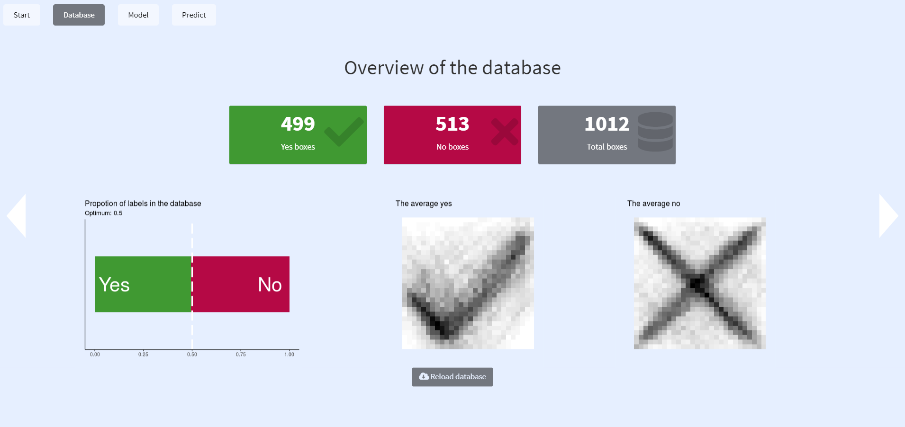
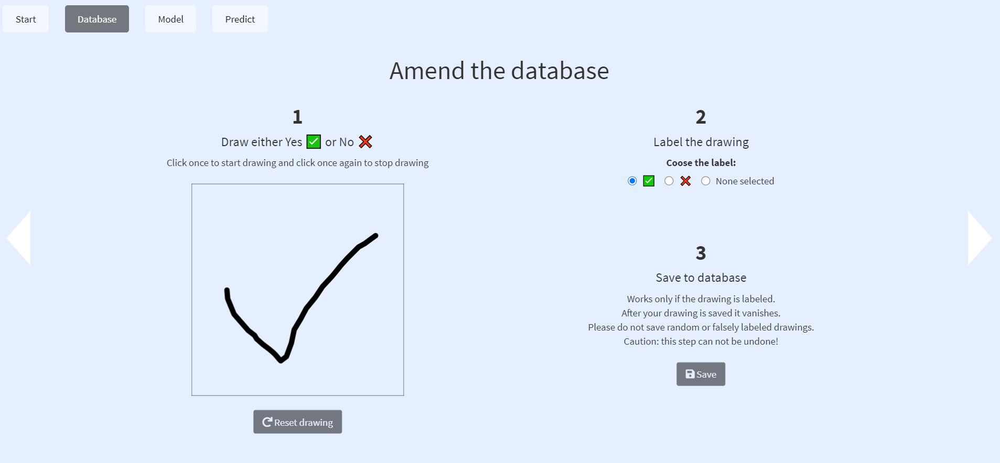
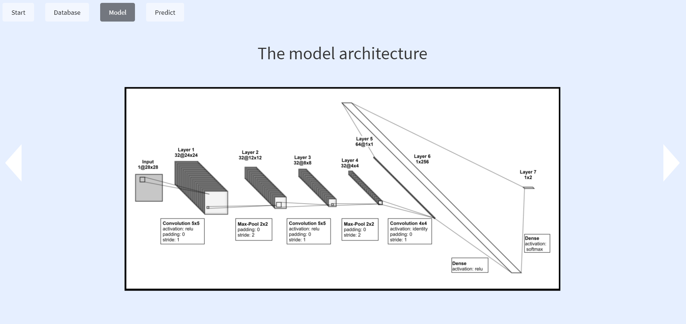
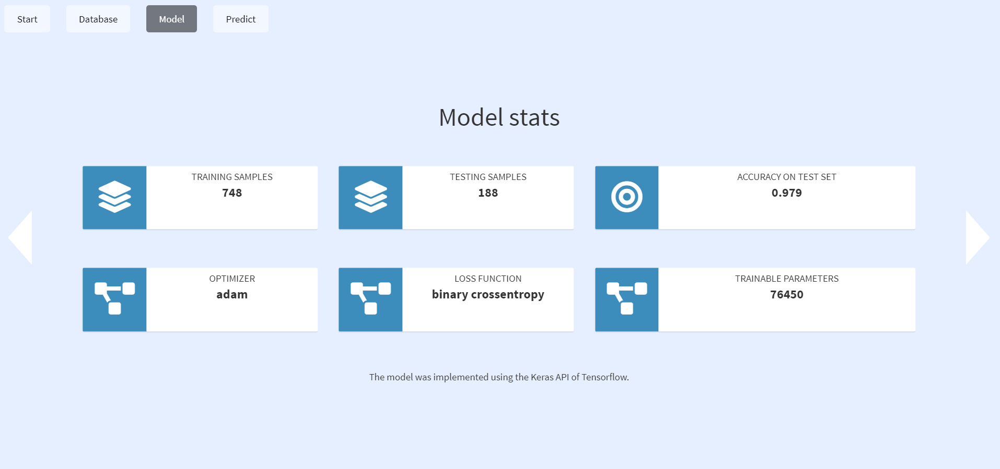
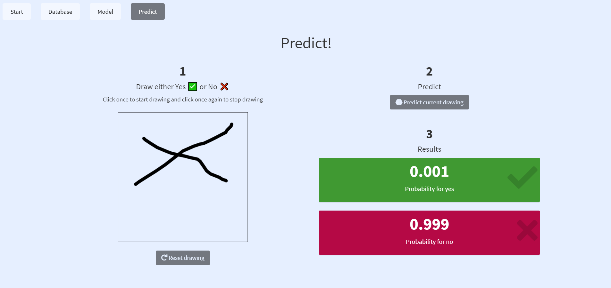

<!-- README.md is generated from README.Rmd. Please edit that file -->

# YesNoDetect

<!-- badges: start -->

<!-- badges: end -->

YesNoDetect is a shiny application for the prediction of handwritten ✅
or ❌ boxes.

It is written using the golem framework for production-grade and robust
shiny apps. The shiny app is embedded inside the structure of an R
package which allows not only a concise and well structured workflow but
also the integration of documentation (roxygen2) and tests (testthat).
The prediction model is a convolutional neural network (CNN) implemented
via the Keras API of Tensorflow.

The main objectives for me writing this code were to dive into the
following packages/ frameworks:

  - **golem**: framework for building production-grade shiny
    applications
  - **shinymodules**: modularize shiny apps
  - **tensorflow/ keras**: modeling deep neural networks

The following packages were also new to me:

  - fullPage: fullPage.js framework for shiny
  - waiter: waiting screens for shiny
  - emo: emojis 😜
  - googlesheets4: use googlesheets (as database)

## Online version

Have a look at the live version:
[Link](https://esommer.shinyapps.io/YesNoDetect/)

Note: The application is built as a desktop application and thus is not
fully operational on touchscreens.

## Installation

You can install the current version of YesNoDetect with the following
line of code:

``` r
# install.packages("devtools")
devtools::install_github("EmanuelSommer/YesNoDetect")
```

You can run the app locally by calling the following:

``` r
YesNoDetect::run_app()
```

## Structure of the app

  - **Database**: Explore and amend the database which is the foundation
    of the modeling process.
  - **Model**: The current model architecture, stats and valuation
    metrics.
  - **Predict**: Challenge the model with your handwritten boxes\!

### Database

To model the handdrawn boxes I obviously needed training data. To get it
I did set up this section. As database I chose a googlesheets file and
implemented functions to write and read it and supplied the permissions
needed. The boxes are saved as 28x28 black and white pictures (as a
flattened 28x28 matrix).

##### First slide

The first of the two slides of this section does give a short overview
of the database:

  - absolute number of boxes (yes, no, total)
  - plot displaying the proportion of yes vs no boxes
  - plots of the average yes and no box



##### Second Slide

The second of the two slides of this section allows the user to amend
the database:

  - draw the box
  - label it
  - save it



### Model

In this section one can find the most important information about the
current model used. After reading several papers to get a good grasp of
some of the state of the art architectures of CNNs for image recognition
I implemented 3 CNNs in the Rmarkdown document in the folder `modeling`.
These were trained and tested on independent test sets and then the best
model is chosen and saved for usage in the app. For a closer look at the
modeling process just read through the Rmarkdown document. It also
contains code to visually inspect wrong predictions and more.

The first slide of this section contains a visualization of the
archictecture of the current model.



The second slide of this section shows essential core and valuation
stats of the current model.



### Predict\!

In this last section one can challenge the current model to predict ones
handwritten ✅ or ❌ boxes and recieves a probability for each class.



## Known issues

#### Drawing not very intuitive

The drawing is not done by clicking, holding and releasing the mouse but
by click, hover and click again. This is not the intuitive way. As the
drawing was implemented by an interactive plot using the hover and click
parameters I could not find a way to change to the intuitive way of
drawing. Moreover I did not find any other (no interactive plots)
solutions for handdrawing in shiny apps and efficiently saving the
drawing numerically.

#### Not touch friendly

The app is not touch friendly this does not only apply to the drawing of
the boxes but the whole fullPage UI seems not to work on mobile well at
all. To deal with this one could switch to shinyMobile but I will try
this out another time.

**If you have any suggestions to solve the known issues or you have new
ones I would really like to hear from you\!**

-----

<center>

👋 **Have fun\!** 👋

</center>
